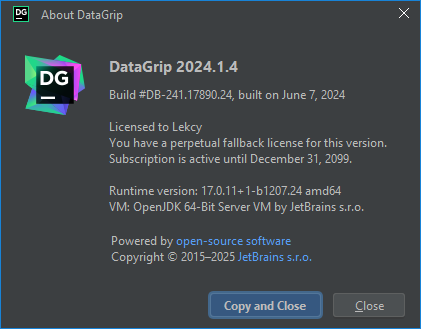
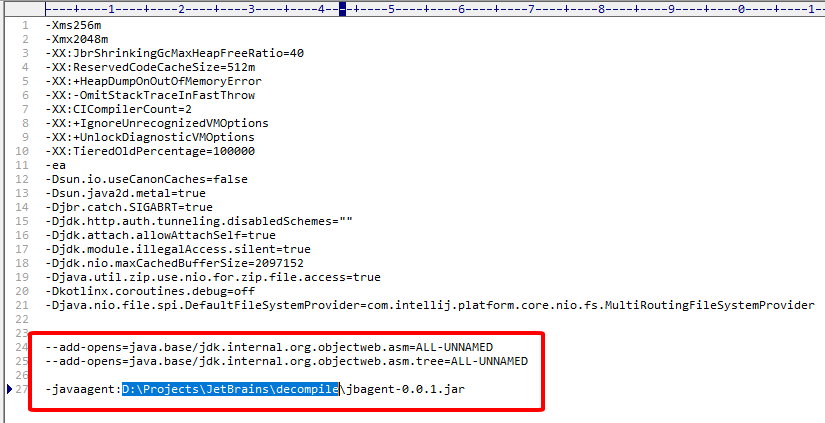
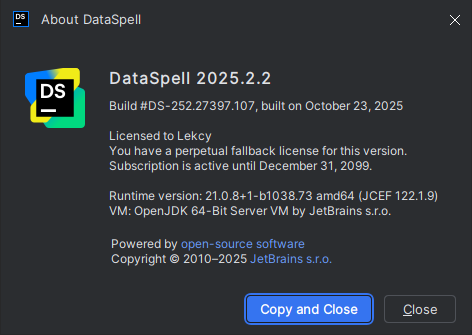

# ja-netfilter-decompile-source-code
### 💡 For education only

https://drive.google.com/file/d/1yYBtTpbEmTjWlfLPl84hcUQCMIiYJEjQ/view?usp=sharing, Pw unzip: lekcy

To DataGrip + DataSpell: Download (./jbagent-0.0.1.jar) to same folder as ja-netfilter.jar on your local PC

